# Conference Hub System Diagrams

This document contains comprehensive Mermaid diagrams for the Conference Hub system as described in Chapter 3: Methodology and System Design.

## 1. System Architecture Overview


## 2. Primary Use Case Diagram

```mermaid
graph TB
    subgraph "Actors"
        RegularUser[👤 Regular User]
        FacilityManager[👨‍💼 Facility Manager]
        Admin[👨‍💻 Admin]
    end
    
    subgraph "Authentication Use Cases"
        Login[🔐 Login]
        Register[📝 Register]
        ResetPassword[🔄 Reset Password]
    end
    
    subgraph "User Use Cases"
        BrowseRooms[🏢 Browse Rooms]
        CreateBooking[📅 Create Booking]
        MakePayment[💳 Make Payment]
        ManageBookings[📋 Manage My Bookings]
        CheckIn[✅ Check-in to Room]
        ViewProfile[👤 View Profile]
    end
    
    subgraph "Facility Manager Use Cases"
        ManageBookings_FM[📊 Manage Bookings]
        ApproveReject[✅❌ Approve/Reject Bookings]
        ManageRooms[🏠 Manage Rooms]
        SendNotifications[📧 Send Notifications]
        ViewReports_FM[📈 View Reports]
    end
    
    subgraph "Admin Use Cases"
        ManageUsers[👥 Manage Users]
        ManageFacilities[🏢 Manage Facilities]
        ViewReports_Admin[📊 View System Reports]
        SystemConfig[⚙️ System Configuration]
        ManagePayments[💰 Manage Payments]
    end
    
    RegularUser --> Login
    RegularUser --> Register
    RegularUser --> BrowseRooms
    RegularUser --> CreateBooking
    RegularUser --> MakePayment
    RegularUser --> ManageBookings
    RegularUser --> CheckIn
    RegularUser --> ViewProfile
    
    FacilityManager --> Login
    FacilityManager --> ManageBookings_FM
    FacilityManager --> ApproveReject
    FacilityManager --> ManageRooms
    FacilityManager --> SendNotifications
    FacilityManager --> ViewReports_FM
    
    Admin --> Login
    Admin --> ManageUsers
    Admin --> ManageFacilities
    Admin --> ViewReports_Admin
    Admin --> SystemConfig
    Admin --> ManagePayments
    
    CreateBooking -.-> MakePayment
    ApproveReject -.-> SendNotifications
    
    classDef actor fill:#e3f2fd,stroke:#1565c0,stroke-width:2px
    classDef authUseCase fill:#fff3e0,stroke:#ef6c00,stroke-width:2px
    classDef userUseCase fill:#e8f5e8,stroke:#2e7d32,stroke-width:2px
    classDef managerUseCase fill:#f3e5f5,stroke:#7b1fa2,stroke-width:2px
    classDef adminUseCase fill:#ffebee,stroke:#c62828,stroke-width:2px
    
    class RegularUser,FacilityManager,Admin actor
    class Login,Register,ResetPassword authUseCase
    class BrowseRooms,CreateBooking,MakePayment,ManageBookings,CheckIn,ViewProfile userUseCase
    class ManageBookings_FM,ApproveReject,ManageRooms,SendNotifications,ViewReports_FM managerUseCase
    class ManageUsers,ManageFacilities,ViewReports_Admin,SystemConfig,ManagePayments adminUseCase
```



## 3. Core Domain Class Diagram

```mermaid
classDiagram
    class User {
        -string id
        -string name
        -string email
        -UserRole role
        -string department
        -string position
        -string phone
        -UserStatus status
        -Date createdAt
        -Date lastLogin
        +login() boolean
        +logout() void
        +updateProfile() boolean
        +resetPassword() boolean
    }

    class Facility {
        -string id
        -string name
        -string description
        -string location
        -string managerId
        -Date createdAt
        -Date updatedAt
        +addRoom() boolean
        +removeRoom() boolean
        +updateDetails() boolean
    }

    class Room {
        -string id
        -string name
        -string facilityId
        -string location
        -number capacity
        -string[] features
        -RoomStatus status
        -number hourlyRate
        -string currency
        -string image
        -string description
        +checkAvailability() boolean
        +updateStatus() boolean
        +calculateCost() number
    }

    class Booking {
        -string id
        -string userId
        -string roomId
        -string title
        -string description
        -Date startTime
        -Date endTime
        -number attendees
        -BookingStatus status
        -string[] resources
        -PaymentStatus paymentStatus
        -Date createdAt
        +create() boolean
        +update() boolean
        +cancel() boolean
        +checkIn() boolean
        +approve() boolean
        +reject() boolean
    }

    class Payment {
        -string id
        -string bookingId
        -number amount
        -string currency
        -PaymentStatus status
        -string paystackRef
        -string paymentMethod
        -Date paidAt
        +initialize() string
        +verify() boolean
        +refund() boolean
    }

    class Resource {
        -string id
        -string name
        -ResourceType type
        -string description
        -boolean isAvailable
        -string[] roomIds
        +assignToRoom() boolean
        +removeFromRoom() boolean
        +checkAvailability() boolean
    }

    User ||--o{ Booking : creates
    Facility ||--o{ Room : contains
    Room ||--o{ Booking : hosts
    Booking ||--o| Payment : requires
    Room }o--o{ Resource : uses
    User ||--|| Facility : manages

    classDef entityClass fill:#e3f2fd,stroke:#1565c0,stroke-width:2px
    classDef valueClass fill:#f3e5f5,stroke:#7b1fa2,stroke-width:2px

    class User,Facility,Room,Booking entityClass
    class Payment,Resource valueClass
```

## 4. Database Schema (ERD)


## 5. Booking Creation Sequence Diagram


## 6. User Authentication Sequence Diagram


## 7. Booking Approval Activity Diagram


## 8. Booking Status State Diagram


## 9. Component Architecture Diagram


## 10. Integration Architecture Diagram


## 11. Deployment Architecture Diagram


## 12. Security Architecture Diagram


## 13. Real-time Communication Architecture


---

*This document contains comprehensive Mermaid diagrams representing all aspects of the Conference Hub system architecture as described in Chapter 3. Each diagram uses professional academic styling with consistent color schemes and clear visual hierarchy suitable for technical documentation.*
